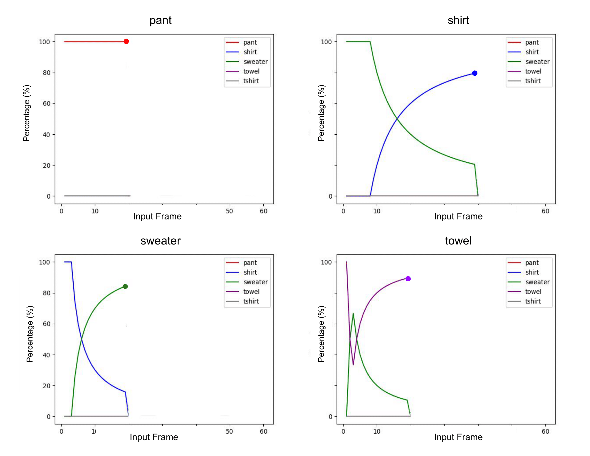
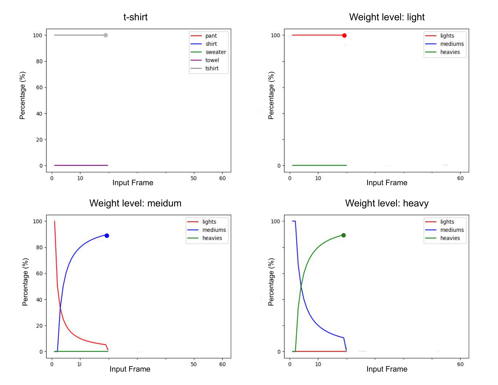
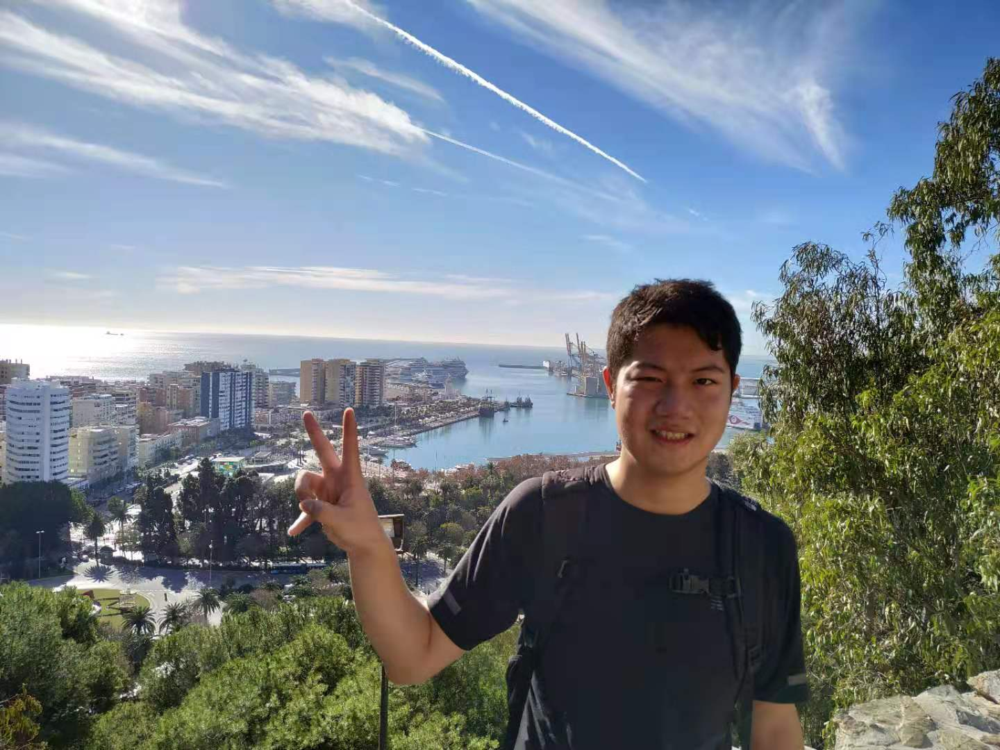

# Garment Similarity Network (GarNet): A Continuous Perception Robotic Approach for Predicting Shapes and Visually Perceived Weights of Unseen Garments
## Introduction
We present a Garment Similarity Network (GarNet) that learns geometric and physical similarities between known garments by continuously observing a garment while a robot picks it up from a table. The aim is to capture and encode geometric and physical characteristics of a garment into a manifold where a decision can be carried out, such as predicting the garment's shape class and its visually perceived weight. Our approach features an early stop strategy, which means that GarNet does not need to observe a garment being picked up from a crumpled to a hanging state to make a prediction. In our experiments, we find that GarNet achieves prediction accuracies of 92% for shape classification and 95.5% for predicting weights and advances state-of-art approaches by 21% for shape classification.

## Video Demonstration
<iframe width="560" height="315" src="https://www.youtube.com/embed/BJl50A1xN08" title="YouTube video player" frameborder="0" allow="accelerometer; autoplay; clipboard-write; encrypted-media; gyroscope; picture-in-picture" allowfullscreen></iframe>

--------------------------------------------------------------------------------------------
## Examples of Early Stop enabled by the GarNet in a Continuous Perception Way
The early-stop strategy allows the robotic system to predict unseen garments’ shapes and discretised weights without observing the entire video sequence, enabling continuous perception. As observed in both plots, GarNet becomes confident over time, and the early-stop strategy activates if 80% of decision points in the garment similarity map are within a correct category.

-----------------------------------------------------------------------------------------------
## Downloads
\
 [<a taget="_blank" title="Paper" href="https://arxiv.org/abs/2109.07831">Paper</a>][<a taget="_blank" title="Code" href="https://github.com/LiDuanAtGlasgow/GarNet">Code</a>][<a taget="_blank" title="Database" href="https://gla-my.sharepoint.com/:u:/g/personal/2168518d_student_gla_ac_uk/EfqXRutgm5VBnKqVXqMUWCoBYXeqsNvibLq3_0KOZWaoRw?e=tgsNAx">Database</a>]

## The Author
\
My name is Li Duan (Ken), and I am a final year PhD student at the University of Glasgow, Scotland. My interests include robot continuous perception and deformable object manipulation. Recently, I have been working on investigating geometric and physical properties of fabrics and garments, through which I am engineering methods to improve robot deformable object manipulations.\
I am willing to hear from our community, so your suggestions are welcomed. Please reach me at:\
Twitter: [@liduanglasgow](https://twitter.com/liduanglasgow)\
Email: <em>l.duan.1 at research.gla.ac.uk</em>
